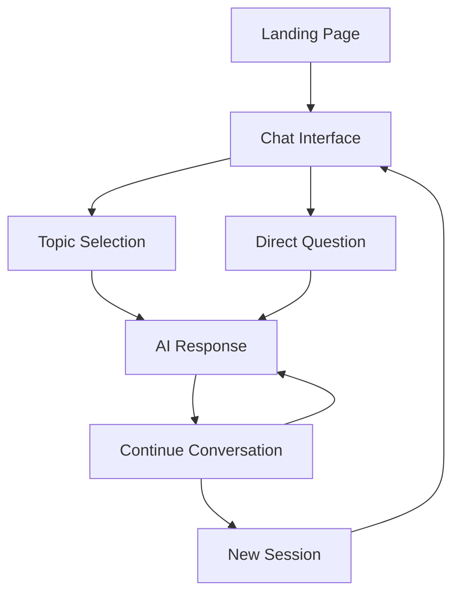

# AI Studying Website - Product Requirements Document

## 1. Product Overview
An AI-powered studying platform that provides students with intelligent tutoring and learning assistance through a clean, minimalist interface.

The platform helps students learn more effectively by offering personalized AI tutoring, instant answers to questions, and interactive study sessions. Target users are students, educators, and lifelong learners seeking efficient study assistance.

## 2. Core Features

### 2.1 User Roles
Since this is an MVP focused on core functionality, we'll implement a default user access model without complex role distinctions.

### 2.2 Feature Module
Our AI studying website consists of the following main pages:
1. **Landing Page**: hero section with value proposition, feature highlights, call-to-action button to start studying.
2. **Chat Interface**: AI conversation area, message input, study session history, topic suggestions.

### 2.3 Page Details

| Page Name | Module Name | Feature description |
|-----------|-------------|---------------------|
| Landing Page | Hero Section | Display compelling headline, brief description of AI tutoring benefits, prominent "Start Studying" button |
| Landing Page | Feature Highlights | Showcase key features with icons: instant answers, personalized learning, 24/7 availability |
| Landing Page | Navigation | Clean header with logo, minimal navigation menu, smooth scrolling to sections |
| Chat Interface | AI Conversation Area | Display chat messages in clean bubbles, show AI responses with proper formatting, scroll to latest messages |
| Chat Interface | Message Input | Text input field with send button, support for multi-line messages, typing indicators |
| Chat Interface | Study Session Management | Start new study session, view previous conversations, clear chat history |
| Chat Interface | Topic Suggestions | Quick-start buttons for common study topics like Math, Science, History, Languages |

## 3. Core Process

**Main User Flow:**
1. User lands on homepage and sees value proposition
2. User clicks "Start Studying" to access chat interface
3. User either selects a suggested topic or types their own question
4. AI provides helpful study assistance and explanations
5. User continues conversation for deeper learning
6. User can start new sessions or review previous conversations

## 4. User Interface Design

### 4.1 Design Style
- **Primary Colors**: Clean white (#FFFFFF) background, soft blue (#4A90E2) for accents
- **Secondary Colors**: Light gray (#F8F9FA) for sections, dark gray (#2C3E50) for text
- **Button Style**: Rounded corners (8px), subtle shadows, hover effects with smooth transitions
- **Typography**: Modern sans-serif font (Inter or similar), 16px base size, clear hierarchy
- **Layout Style**: Minimalist card-based design, generous white space, centered content
- **Icons**: Simple line icons, consistent stroke width, subtle animations on hover

### 4.2 Page Design Overview

| Page Name | Module Name | UI Elements |
|-----------|-------------|-------------|
| Landing Page | Hero Section | Large centered headline, subtitle text, prominent CTA button with gradient background, clean typography hierarchy |
| Landing Page | Feature Highlights | Three-column grid layout, icon + title + description cards, subtle hover animations |
| Landing Page | Navigation | Fixed header with logo on left, minimal menu items, transparent background with blur effect |
| Chat Interface | AI Conversation Area | Clean chat bubbles with rounded corners, AI messages in light blue, user messages in white with blue border |
| Chat Interface | Message Input | Full-width input field with rounded corners, send button with arrow icon, auto-resize for multi-line |
| Chat Interface | Topic Suggestions | Horizontal scrollable pills with topic names, soft colors, smooth hover transitions |

### 4.3 Responsiveness
Desktop-first design with mobile-adaptive layout. Touch-optimized interface for mobile devices with larger tap targets and swipe gestures for navigation.